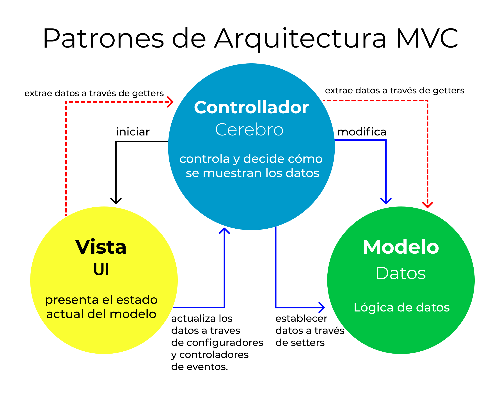
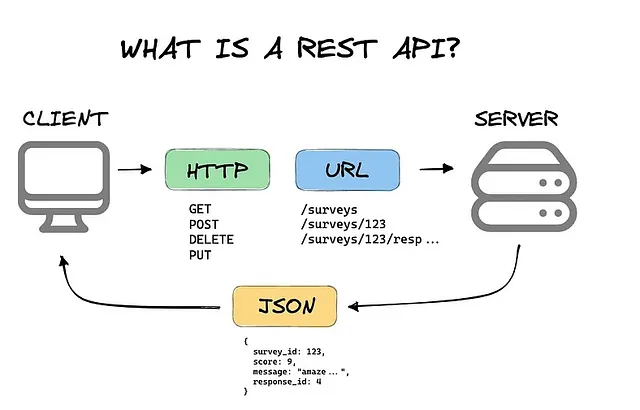
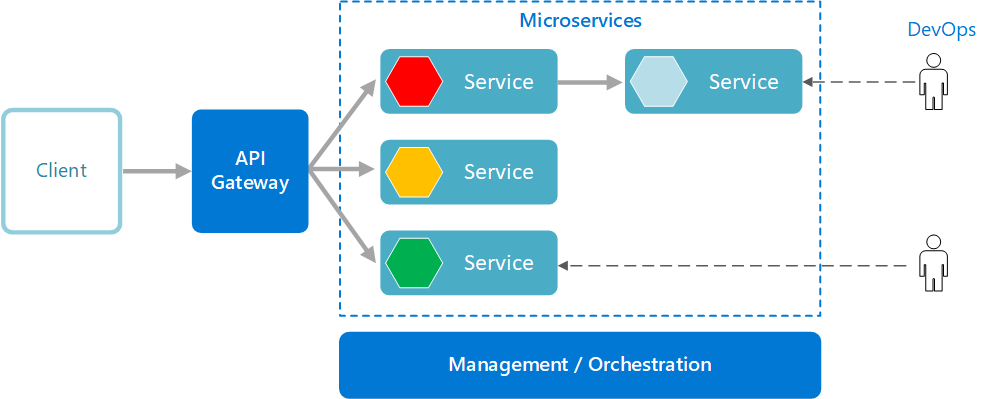

# Patrones de Arquitectura: MVC, API REST y Microservicios

## 1. Patrón de Arquitectura MVC (Modelo-Vista-Controlador)

El patrón **MVC (Model-View-Controller)** es una metodología de diseño de software que separa una aplicación en tres componentes interrelacionados:

- **Modelo (Model)**: Gestiona los datos y la lógica de negocio de la aplicación.
- **Vista (View)**: Se encarga de la presentación y la interfaz de usuario.
- **Controlador (Controller)**: Actúa como intermediario entre el Modelo y la Vista, manejando la interacción del usuario y actualizando el Modelo y la Vista según sea necesario.

Esta separación facilita la gestión y escalabilidad de aplicaciones complejas, permitiendo que diferentes desarrolladores trabajen simultáneamente en distintas partes sin interferencias.

### Diagrama del patrón MVC

La imagen ilustra el flujo de datos en el patrón **Modelo-Vista-Controlador (MVC)**:

- **Controlador (Controller)**: Actúa como el cerebro del sistema, decidiendo cómo se muestran los datos y manejando la interacción entre la Vista y el Modelo.
- **Modelo (Model)**: Gestiona la lógica de datos y permite modificar o establecer la información mediante setters.
- **Vista (View)**: Representa la interfaz de usuario, mostrando el estado actual del modelo y actualizándolo a través de configuradores y controladores de eventos.

Este patrón permite una separación clara de responsabilidades, facilitando el mantenimiento y escalabilidad del software.

---

## 2. API REST (Representational State Transfer)

Una **API REST** es una interfaz que sigue los principios de diseño de la arquitectura **REST**, permitiendo la comunicación entre sistemas a través de **HTTP**. Sus características principales incluyen:

- **Arquitectura Cliente-Servidor**: Separación entre el cliente (que solicita recursos) y el servidor (que los provee).
- **Sin Estado (Stateless)**: Cada solicitud debe contener toda la información necesaria para procesar la petición sin depender de un estado almacenado en el servidor.
- **Cacheable**: Las respuestas pueden ser almacenadas en caché para mejorar el rendimiento.
- **Interfaz Uniforme**: Uso de métodos HTTP estándar como `GET`, `POST`, `PUT`, `DELETE`, y rutas claras para acceder a los recursos.

Este enfoque es ampliamente utilizado debido a su **simplicidad y escalabilidad** en la comunicación entre aplicaciones.

### Diagrama de Arquitectura API REST

La imagen muestra un esquema de una arquitectura **API REST** donde:

- **Cliente**: Representa al usuario o aplicación que realiza solicitudes.
- **Servidor**: Procesa las solicitudes y envía respuestas adecuadas.
- **Métodos HTTP**: Se ilustran los métodos estándar como `GET`, `POST`, `PUT` y `DELETE` utilizados para interactuar con los recursos.

Este diseño promueve una comunicación eficiente y escalable entre clientes y servidores.

En la imagen se muestra cómo funciona una **API REST**, donde:

- Un **cliente** envía solicitudes a través de **métodos HTTP** como `GET`, `POST`, `DELETE` y `PUT`.
- Cada solicitud se dirige a una **URL específica** donde se encuentran los recursos.
- Un **servidor** procesa la solicitud y devuelve una respuesta en **formato JSON**, que contiene la información solicitada.

Este modelo permite una comunicación eficiente y estructurada entre aplicaciones en la web.

---

## 3. Arquitectura de Microservicios

La **arquitectura de microservicios** descompone una aplicación en pequeños servicios independientes que se ejecutan en su propio proceso y se comunican mediante protocolos ligeros como HTTP.

Cada microservicio se enfoca en una funcionalidad específica y puede ser desarrollado, desplegado y escalado de manera autónoma. Sus ventajas incluyen:

- **Escalabilidad**: Se pueden escalar componentes individuales según la demanda.
- **Flexibilidad Tecnológica**: Cada microservicio puede ser desarrollado en diferentes lenguajes o tecnologías.
- **Mantenibilidad**: Facilita la actualización y mantenimiento de componentes sin afectar al resto del sistema.

Sin embargo, también presenta desafíos, como la **complejidad en la gestión** de múltiples servicios y la comunicación entre ellos.

### Casos de uso de los Microservicios

La arquitectura de microservicios es utilizada por empresas tecnológicas líderes debido a su capacidad para manejar sistemas escalables y de alta disponibilidad. Algunos ejemplos son:

- **Netflix**: Usa microservicios para gestionar diferentes aspectos de su plataforma de streaming, asegurando que cada servicio pueda escalar de forma independiente.
- **Amazon**: Implementa microservicios para administrar su infraestructura de comercio electrónico, facilitando la expansión y mantenimiento de funciones específicas.
- **Uber**: Ha migrado de una arquitectura monolítica a microservicios para mejorar el rendimiento y la estabilidad de sus servicios de transporte.

> En esta imagen se representa el flujo de trabajo de una arquitectura de **microservicios**, donde:

- Un **cliente** interactúa con el sistema a través de un **API Gateway**.
- Los **microservicios** manejan diferentes funciones de manera independiente.
- Se cuenta con un sistema de **gestión y orquestación** para administrar los servicios.
- **DevOps** es responsable del mantenimiento y mejora continua de la arquitectura.

Este modelo permite una alta escalabilidad, flexibilidad y resiliencia en el desarrollo de aplicaciones modernas.

---

## Referencias

- FreeCodeCamp. (s.f.). *El modelo de arquitectura View-Controller Pattern*. FreeCodeCamp. Recuperado el 18 de febrero de 2025, de [https://www.freecodecamp.org/espanol/news/el-modelo-de-arquitectura-view-controller-pattern/](https://www.freecodecamp.org/espanol/news/el-modelo-de-arquitectura-view-controller-pattern/)

- Red Hat. (s.f.). *¿Qué es una API REST?*. Red Hat. Recuperado el 18 de febrero de 2025, de [https://www.redhat.com/es/topics/api/what-is-a-rest-api](https://www.redhat.com/es/topics/api/what-is-a-rest-api)

- Paradigma Digital. (2022). *Patrones de arquitectura de microservicios: ¿Qué son y qué ventajas tienen?*. Paradigma Digital. Recuperado el 18 de febrero de 2025, de [https://www.paradigmadigital.com/dev/patrones-arquitectura-microservicios-que-son-ventajas/](https://www.paradigmadigital.com/dev/patrones-arquitectura-microservicios-que-son-ventajas/)

- Atlassian. (s.f.). *Microservices architecture*. Atlassian. Recuperado el 18 de febrero de 2025, de [https://www.atlassian.com/es/microservices/microservices-architecture](https://www.atlassian.com/es/microservices/microservices-architecture)

- HL7 LATAM. (2018). *REST Web API*. Blog HL7 Latinoamérica. Recuperado el 18 de febrero de 2025, de [https://hl7latam.blogspot.com/2018/07/rest-web-api.html](https://hl7latam.blogspot.com/2018/07/rest-web-api.html)
