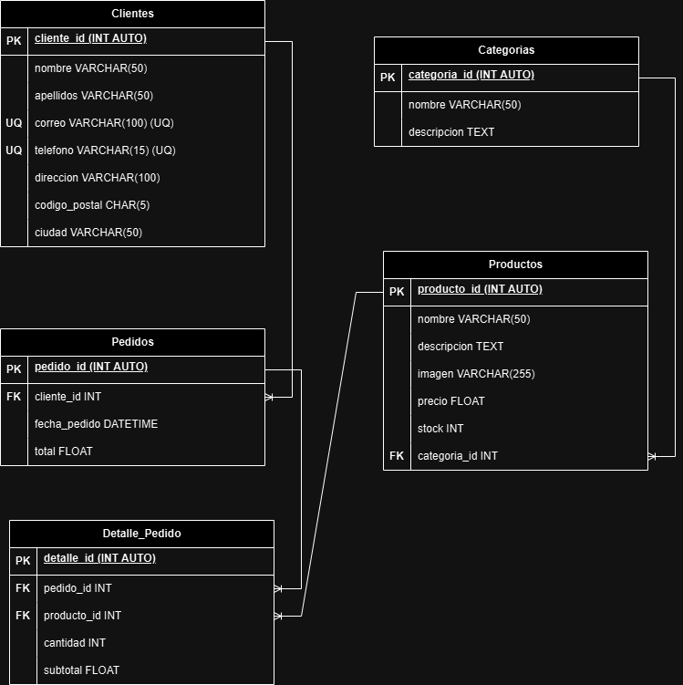

# Modelado de Datos - Hogar&Magia

## 1. Modelo Entidad–Relación

### Entidades y atributos

#### clientes
- cliente_id (PK)
- nombre
- apellidos
- correo (UQ)
- telefono (UQ)
- direccion
- codigo_postal
- ciudad

#### productos
- producto_id (PK)
- nombre
- descripcion
- imagen
- precio
- stock
- categoria_id (FK)

#### categorias
- categoria_id (PK)
- nombre
- descripcion

#### pedidos
- pedido_id (PK)
- cliente_id (FK)
- fecha_pedido
- total

#### detalle_pedido
- detalle_id (PK)
- pedido_id (FK)
- producto_id (FK)
- cantidad
- subtotal

---

## 2. Diagrama Relacional

---
## 3. Relaciones entre Entidades

1. Un **cliente** puede generar muchos **pedidos** (1:M).  
2. Un **pedido** puede tener varios **detalles de pedido** (1:M).  
3. Un **producto** puede aparecer en muchos **detalles de pedido** (1:M).  
4. Una **categoría** puede tener muchos **productos** (1:M).

---

## 4. Reglas de Negocio

### clientes
1. Crear cliente.  
2. Leer todos los clientes.  
3. Leer un cliente específico.  
4. Actualizar cliente.  
5. Eliminar cliente.  

### productos
1. Crear producto.  
2. Leer todos los productos.  
3. Leer un producto específico.  
4. Actualizar producto.  
5. Eliminar producto.  
6. Cada vez que se realiza una venta, se descuenta del stock del producto la cantidad vendida.  

### categorias
1. Crear categoría.  
2. Leer todas las categorías.  
3. Leer una categoría específica.  
4. Actualizar categoría.  
5. Eliminar categoría.  

### pedidos
1. Crear pedido.  
2. Leer todos los pedidos.  
3. Leer los pedidos de un cliente.  
4. Leer un pedido específico.  
5. Actualizar pedido.  
6. Eliminar pedido.  

### detalle_pedido
1. Crear línea de pedido.  
2. Leer todos los detalles.  
3. Leer los detalles de un pedido.  
4. Leer los pedidos de un producto. 
5. Actualizar detalle.  
6. Eliminar detalle.  
